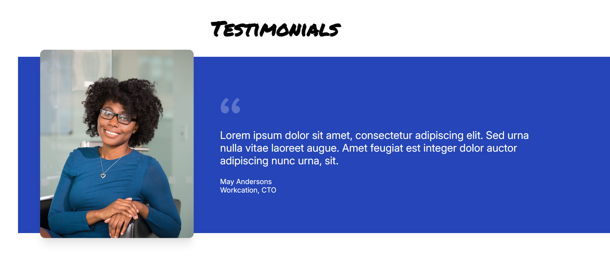
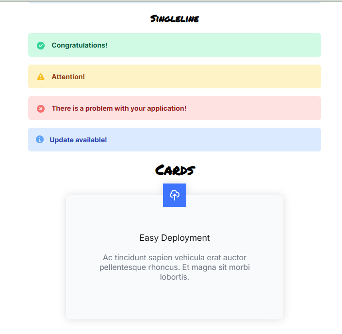

# 📦 React Component Library

> A simple and interactive component library built using **React** and **CSS**.

## 📑 Table of Contents

- [General Info](#general-info)
- [Screenshots](#screenshots)
- [Technologies](#technologies)
- [Setup](#setup)
- [Code Examples](#code-examples)
- [Features](#features)
- [Project Status](#project-status)
- [Inspiration](#inspiration)
- [Contact](#contact)

---

## 📌 General Info

This is a React component library containing reusable UI elements such as badges, banners, cards, and testimonials.

## 🖼️ Screenshots




## 🛠 Technologies

- React.js
- CSS

## ⚙️ Setup

1. Clone the repository:
   ```sh
   git clone <repository-url>
   ```
2. Navigate to the project directory:
   ```sh
   cd <project-directory>
   ```
3. Install dependencies:
   ```sh
   npm install
   ```
4. Start the development server:
   ```sh
   npm start
   ```

## 🧩 Code Examples

### Example Badge Component:

```jsx
<Badge color="blue" className="pill">
  Badge
</Badge>
```

### Example Banner Component:

```jsx
<Banner className="singleline" type="success">
  <Banner.Success>
    
  </Banner.Success>
  <Banner.Text>
    <Banner.Title>Congratulations!</Banner.Title>
  </Banner.Text>
</Banner>
```

## ✨ Features

- Reusable UI components
- Easy customization
- Modular design

## 🚧 Project Status

Currently in development for learning and practice purposes.

## 💡 Inspiration

This project was created to practice building reusable React components and improve front-end development skills.

## 📬 Contact

For any inquiries, reach out at [boba-milktea](https://github.com/boba-milktea).
